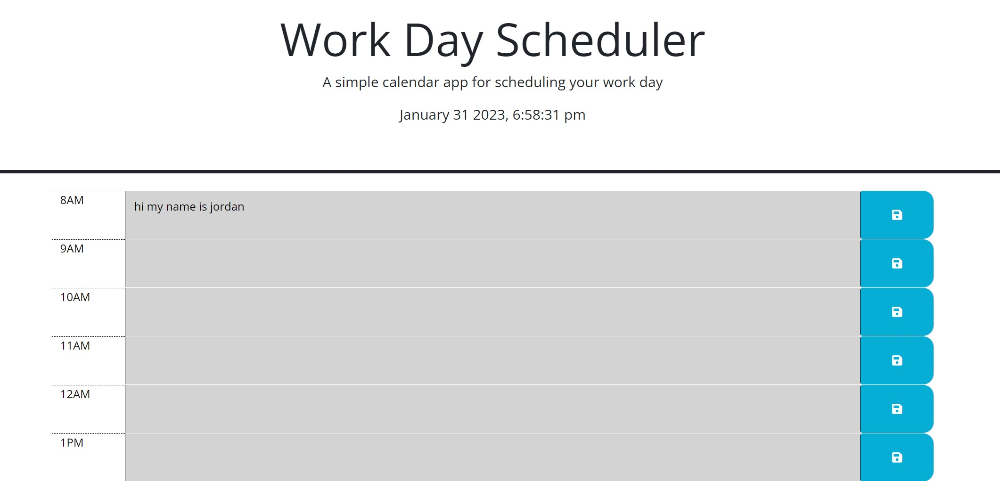

# get-it-done-calendar
Hourly calendar for the work day

WORK DAY CALENDAR

DESCRIPTION: 
A SIMPLE HOURLY CALENDAR THAT MAPS OUT THE WORK DAY. IT ALLOWS YOU TO KEEP TRACK OF YOUR WORK DAY HOUR TO HOUR. I MADE IT FROM 8AM-5PM. IT IS COLOR CODED BY THE TIME BEING IN THE PAST PRESENT AND FUTURE. YOU CAN ADD TASKS OR ANY TEXT TO EACH HOUR. THEN YOU CAN CLICK THE SAVE BUTTONS FOR EACH HOUR AND IT SAVES THE TEXT. 

https://jordanne37.github.io/get-it-done-calendar/

https://github.com/jordanne37/get-it-done-calendar
